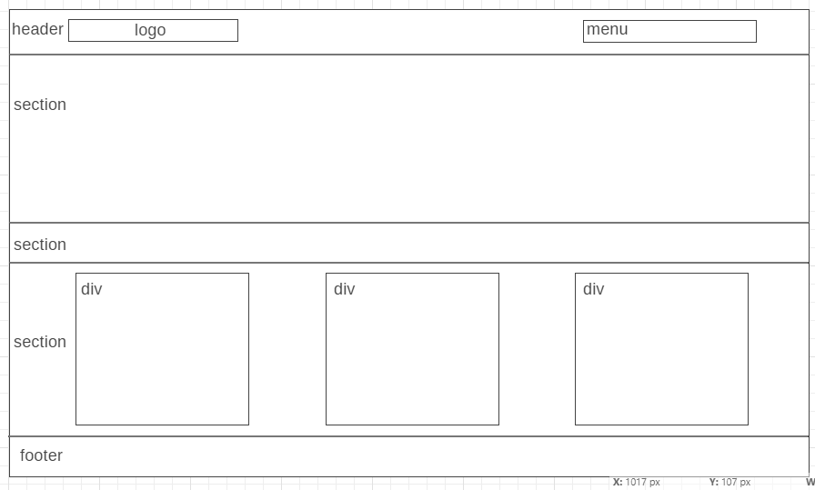

# Development Strategy

> `acme-web-design`

This project is HTML&CSS example of implementation of incremental developing pattern.

## Wireframe (index page)

<!-- include a wireframe for your project in this repository, and display it here -->
<!-- wireframe.cc is a good site for getting started with wireframes -->

## 1. Description

### Git Branches: 

#### index-html : 
  * HTML: index page general markup
  
#### index-css : 
  * CSS: index page general styling

#### index-style-det : 
  * CSS: index page details styling

#### about-html: 
  * HTML: about page markup

#### about-style: 
  * CSS: about page styling

#### services-page: services page markup and styling
  * HTML: services page markup
  * CSS: services page styling

#### responsive
* CSS: dding styling for responsive design

#### bugfix
* HTML and CSS: bug fixing
* code validating
* development strategy and readme editing

## 2. Readme file
* [readme.md](README.md)

## 3. Bugs founded

HTML and CSS have been validated via https://validator.w3.org/

